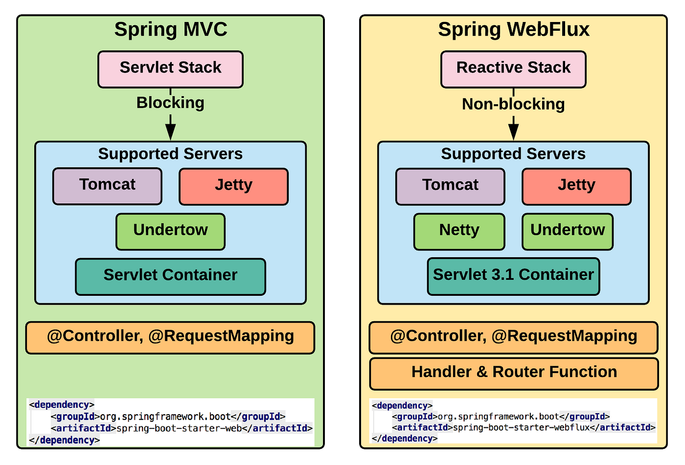

# Introduction To Reactive Programming

## Reactive Manifesto

[Link to Reactive Manifesto](https://www.reactivemanifesto.org/)

Published on September 16 2014. (v2.0)

Organisations working in disparate domains are independently discovering patterns for building software that look the same. These systems are more robust, more resilient, more flexible and better positioned to meet modern demands.

These changes are happening because application requirements have changed dramatically in recent years. Only a few years ago a large application had tens of servers, seconds of response time, hours of offline maintenance and gigabytes of data. Today applications are deployed on everything from mobile devices to cloud-based clusters running thousands of multi-core processors. Users expect millisecond response times and 100% uptime. Data is measured in Petabytes. Today's demands are simply not met by yesterday’s software architectures.

We believe that a coherent approach to systems architecture is needed, and we believe that all necessary aspects are already recognised individually: we want systems that are **Responsive**, **Resilient**, **Elastic** and **Message Driven**. We call these Reactive Systems.

Systems built as Reactive Systems are more flexible, loosely-coupled and scalable. This makes them easier to develop and amenable to change. They are significantly more tolerant of failure and when failure does occur they meet it with elegance rather than disaster. Reactive Systems are highly responsive, giving users effective interactive feedback.

Reactive Systems are:

**Responsive**: The system responds in a timely manner if at all possible. Responsiveness is the cornerstone of usability and utility, but more than that, responsiveness means that problems may be detected quickly and dealt with effectively. Responsive systems focus on providing rapid and consistent response times, establishing reliable upper bounds so they deliver a consistent quality of service. This consistent behaviour in turn simplifies error handling, builds end user confidence, and encourages further interaction.

**Resilient**: The system stays responsive in the face of failure. This applies not only to highly-available, mission-critical systems — any system that is not resilient will be unresponsive after a failure. Resilience is achieved by replication, containment, isolation and delegation. Failures are contained within each component, isolating components from each other and thereby ensuring that parts of the system can fail and recover without compromising the system as a whole. Recovery of each component is delegated to another (external) component and high-availability is ensured by replication where necessary. The client of a component is not burdened with handling its failures.

**Elastic**: The system stays responsive under varying workload. Reactive Systems can react to changes in the input rate by increasing or decreasing the resources allocated to service these inputs. This implies designs that have no contention points or central bottlenecks, resulting in the ability to shard or replicate components and distribute inputs among them. Reactive Systems support predictive, as well as Reactive, scaling algorithms by providing relevant live performance measures. They achieve elasticity in a cost-effective way on commodity hardware and software platforms.

**Message Driven**: Reactive Systems rely on asynchronous message-passing to establish a boundary between components that ensures loose coupling, isolation and location transparency. This boundary also provides the means to delegate failures as messages. Employing explicit message-passing enables load management, elasticity, and flow control by shaping and monitoring the message queues in the system and applying back-pressure when necessary. Location transparent messaging as a means of communication makes it possible for the management of failure to work with the same constructs and semantics across a cluster or within a single host. Non-blocking communication allows recipients to only consume resources while active, leading to less system overhead.

----

## What is Reactive Programming?

Interactive programs work at their own pace and mostly deal with communication, while reactive programs only work in response to external demands and mostly deal with accurate interrupt handling.

**Reactive programming** is a declarative programming paradigm that entails building asynchronous, non-blocking and event-driven applications that leverage asynchronous data streams and can easily scale.

A Stream can emit three things:

- A value
- An error
- A completed signal

### Features of Reactive Programming

- Data Stream
- Asynchronous
    - Events are captured asynchronously.
    - A function is defined to execute when an event is emitted.
    - Another function is defined if an error is emitted.
    - This can be a difficult paradigm to adjust to when first getting started.
- Non-blocking
  - The concept of using non-blocking is important.
  - In blocking, the code will stop and wait for more data (ie reading from disk, network, etc).
  - Non-blocking in contrast, will process available data, ask to be notified when more is available, then continue.
- Backpressure
  - The ability of subscriber to throttle data.
- Failures as Messages
  - Exceptions are not thrown in a traditional sense.
  - Would break processing of stream.
  - Exceptions are processed by a handler function.

### Gang of fours Observer Pattern

----

## Reactive Streams API

[https://www.reactive-streams.org/](https://www.reactive-streams.org/)

Reactive Streams is an initiative to provide a standard for asynchronous stream processing with non-blocking back pressure. This encompasses efforts aimed at runtime environments (JVM and JavaScript) as well as network protocols.

[Java 9 Reactive Streams](https://www.baeldung.com/java-9-reactive-streams)

### Spring MVC & Spring WebFlux

## Spring Reactive Types

Two new reactive types are introduced with Spring Framework 5.

- **Mono** - is a publisher with zero or one elements in data stream.
- **Flux** - is a publisher with zero or MANY elements in the data stream.
  - Both types implement the Reactive Streams Publisher interface.

# How To Create A Spring Boot Project

[https://start.spring.io/](https://start.spring.io/)

