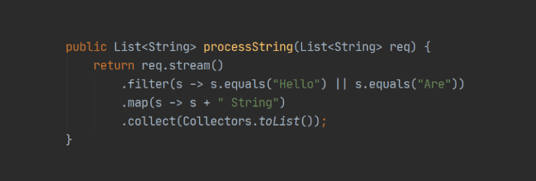

# Functional Programming

[Source](https://www.baeldung.com/java-functional-programming)

Basically, functional programming is a style of writing computer programs that treat computations as evaluating mathematical functions.

In mathematics, a function is an expression that relates an input set to an output set.

Importantly, the output of a function depends only on its input. More interestingly, we can compose two or more functions together to get a new function.

